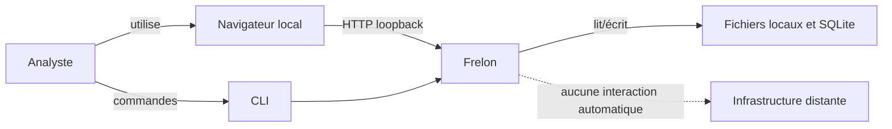
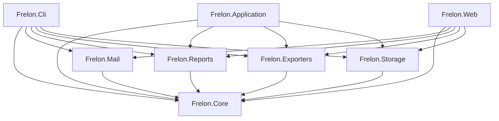
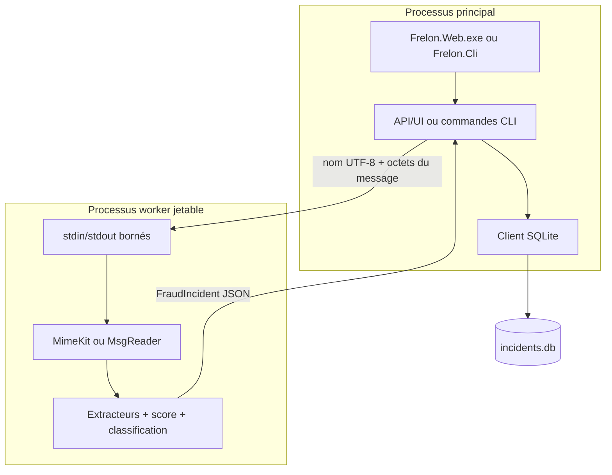
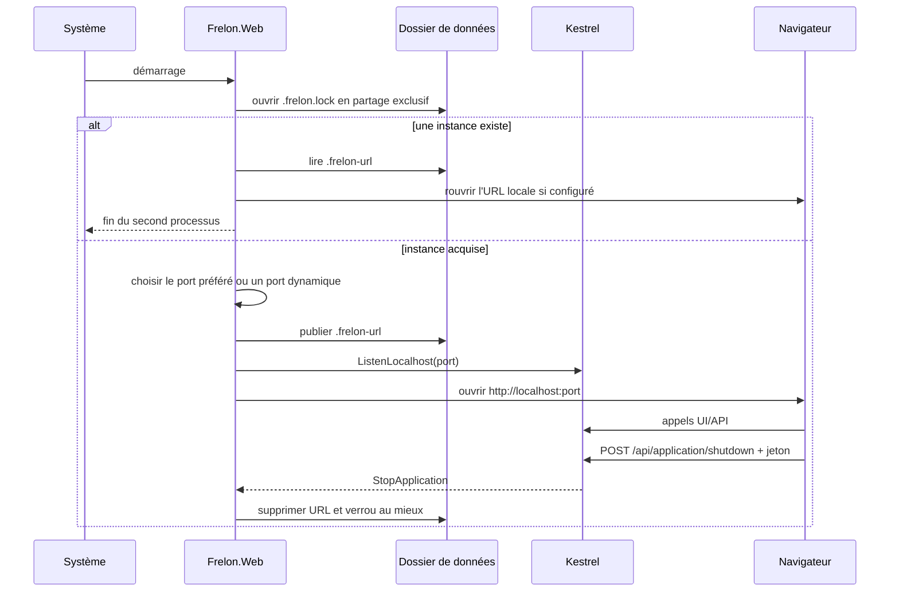

# 01 — Architecture

## 1. Vue de contexte

Frelon s'exécute sur le poste de l'analyste. Les seules interactions prévues sont l'accès à un fichier EML/MSG, au navigateur local, à la sortie de fichiers explicitement demandée par la CLI et à une base SQLite locale.



La relation vers une infrastructure distante est une **non-relation contractuelle** : aucune API externe, aucun DNS et aucun client HTTP n'appartiennent au pipeline d'analyse.

## 2. Découpage de la solution

La solution contient huit projets de production ciblant `net10.0`.

| Projet | Responsabilité | Dépendances de projet |
|---|---|---|
| `Frelon.Core` | modèle métier pur, score, classification, corrélation | aucune |
| `Frelon.Mail` | parsing EML/MSG, extraction et isolation du worker | `Core` |
| `Frelon.Reports` | JSON et Markdown, rapports validés, takedown packs | `Core` |
| `Frelon.Exporters` | CSV et paquets IOC minimisés | `Core` |
| `Frelon.Storage` | persistance SQLite, consultation et orchestration de campagne | `Core` |
| `Frelon.Application` | cas d'usage transverses d'export/takedown | `Core`, `Exporters`, `Reports`, `Storage` |
| `Frelon.Cli` | analyse batch, fichiers de sortie, consultation SQLite | `Core`, `Mail`, `Reports`, `Exporters`, `Storage` |
| `Frelon.Web` | serveur local, API, UI, historique et revues | `Core`, `Mail`, `Reports`, `Exporters`, `Storage` |

Point notable : `Frelon.Web` et `Frelon.Cli` ne référencent pas `Frelon.Application`. Les cas d'usage de takedown pack et d'export IOC minimisé sont donc disponibles comme bibliothèques, mais pas encore câblés dans ces interfaces.



## 3. Architecture logique

### 3.1 Domaine

`Frelon.Core` porte les règles sans dépendance technique :

- `FraudIncident` est le snapshot automatique principal ;
- `IncidentReviewDecision` et `CampaignReviewDecision` représentent le jugement humain ;
- `BasicIncidentRiskScorer`, `CautiousIncidentClassifier` et `BasicIncidentCorrelator` sont déterministes ;
- les interfaces `IIncidentRiskScorer`, `IIncidentClassifier` et `IIncidentCorrelator` permettent la substitution en test.

### 3.2 Adaptateurs d'entrée

- `Frelon.Web.Program` configure Kestrel, l'injection de dépendances et les routes Minimal API.
- `Frelon.Cli.Program` délègue à `CliApplication`.
- les deux points d'entrée reconnaissent l'argument privé `--frelon-internal-analysis-worker` avant toute initialisation de façade.

### 3.3 Pipeline d'analyse

La fabrique de référence assemble :

```csharp
new BasicEmailIncidentAnalyzer(
    new EmailEvidenceParser(),
    new BasicEmailHeaderAnalyzer(),
    new BasicEmailUrlExtractor(),
    new BasicUrlIocExtractor(),
    new BasicEmailAttachmentAnalyzer(),
    new BasicAttachmentIocExtractor(),
    new BasicIncidentRiskScorer(),
    new CautiousIncidentClassifier());
```

Ce pipeline s'exécute normalement dans un processus enfant via `IsolatedEmailAnalysis.CreateAnalyzer()`.

### 3.4 Persistance

`SqliteIncidentStore` implémente trois ports :

- `IIncidentStore` ;
- `IIncidentReviewStore` ;
- `ICampaignReviewStore`.

Le même singleton est enregistré pour les trois interfaces dans le Web. La base n'est initialisée qu'à la première opération d'un workspace, sous verrou asynchrone.

### 3.5 Présentation et production documentaire

Le Web projette l'agrégat complet vers `IncidentPresentation`, volontairement plus compact. Les exports complets sont produits en mémoire par `IncidentExportService`. La CLI produit des fichiers temporaires puis les publie par déplacement sans écrasement.

## 4. Topologie d'exécution



Le protocole parent/enfant est :

1. entier 32 bits little-endian donnant la longueur UTF-8 du nom de fichier ;
2. nom de fichier, au plus 4 Kio ;
3. tous les octets restants constituent le message ;
4. la sortie standard contient un seul `FraudIncident` JSON ;
5. les codes internes sont `0`, `11` (entrée invalide), `12` (quota dépassé) et `13` (échec interne).

La sortie est limitée à 16 Mio et l'erreur standard à 64 Kio.

## 5. Composition Web

Les enregistrements essentiels sont :

| Contrat/service | Implémentation/durée de vie |
|---|---|
| `IIncidentStore`, `IIncidentReviewStore`, `ICampaignReviewStore` | même singleton `SqliteIncidentStore` |
| `IIncidentCorrelator` | singleton `BasicIncidentCorrelator` |
| `ICampaignCorrelationService` | singleton `LocalCampaignCorrelationService` |
| `ICampaignConsultationService` | singleton `LocalCampaignConsultationService` |
| `ICampaignReviewService` | singleton `LocalCampaignReviewService` |
| `IEmailIncidentAnalyzer` | singleton de l'analyseur isolé, sérialisé par `SemaphoreSlim` |
| `LocalIncidentWorkspace`, `LocalCampaignWorkspace` | singletons |
| `IncidentExportService` | singleton, sans état métier mutable |
| `LocalApplicationControl` | singleton, détenteur du jeton d'arrêt éphémère |

Une seule analyse est exécutée à la fois par instance Web ou CLI, car `ProcessIsolatedAnalyzer` protège l'appel avec un sémaphore de capacité 1.

## 6. Cycle de vie Web



## 7. Dépendances externes

| Paquet | Version verrouillée | Usage |
|---|---:|---|
| `MimeKit` | 4.17.0 | parsing MIME/EML |
| `MsgReader` | 6.1.0 | lecture des conteneurs Outlook MSG |
| `Microsoft.Data.Sqlite.Core` | 10.0.10 | accès ADO.NET à SQLite |
| `SQLitePCLRaw.bundle_e_sqlite3` | 3.0.5 | moteur SQLite natif embarqué |

Les graphes NuGet sont verrouillés par `packages.lock.json`. Le build active l'audit NuGet et transforme les vulnérabilités élevées/critiques (`NU1903`, `NU1904`) en erreurs.

## 8. Propriétés non fonctionnelles observables

| Propriété | Réalisation |
|---|---|
| Déterminisme | règles sans réseau ni modèle probabiliste ; ordre stable des sorties importantes |
| Bornage | taille source, profondeurs MIME, corps, en-têtes, pièces jointes, temps, mémoire et IPC |
| Auditabilité | snapshots JSON, SHA-256, décisions append-only, manifestes d'export |
| Portabilité | bibliothèques et CLI en `net10.0`; isolation renforcée spécifique à Windows |
| Confidentialité | stockage local, aucun enrichissement distant, exports minimisés disponibles |
| Tolérance aux pannes | worker jetable ; nettoyage au mieux des fichiers temporaires |

## 9. Références de code

- [`Frelon.slnx`](../../Frelon.slnx)
- [`EmailIncidentAnalyzerFactory.cs`](../../src/Frelon.Mail/EmailIncidentAnalyzerFactory.cs)
- [`IsolatedEmailAnalysis.cs`](../../src/Frelon.Mail/IsolatedEmailAnalysis.cs)
- [`Program.cs` Web](../../src/Frelon.Web/Program.cs)
- [`CliApplication.cs`](../../src/Frelon.Cli/CliApplication.cs)
- [`SqliteIncidentStore.cs`](../../src/Frelon.Storage/SqliteIncidentStore.cs)
