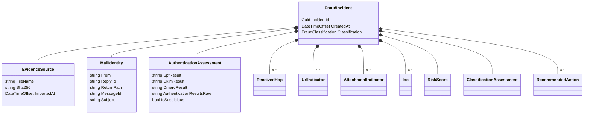
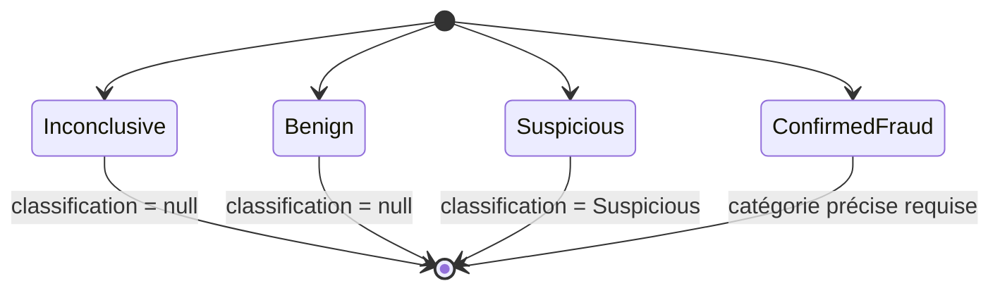
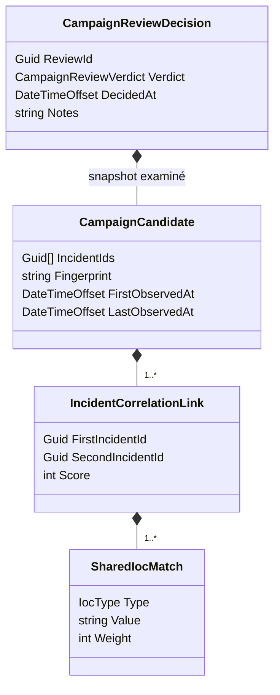
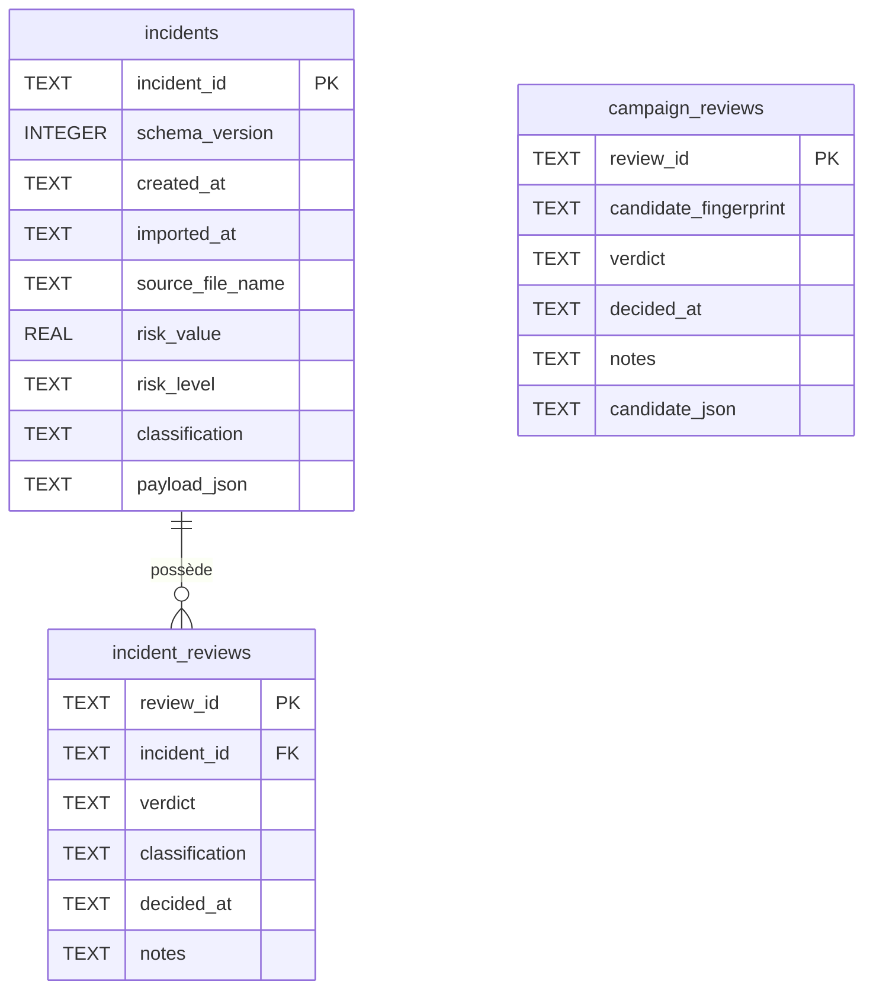
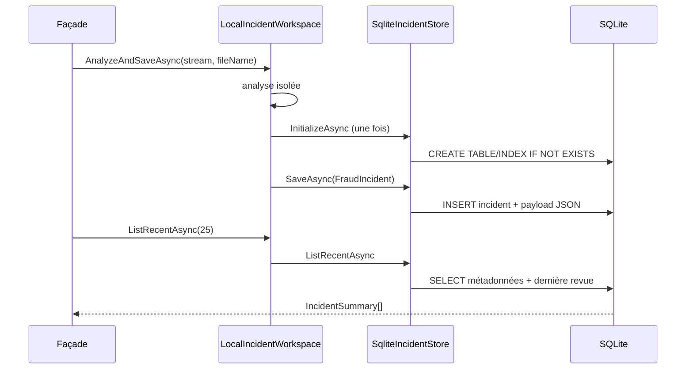

# 02 — Domaine et stockage

## 1. Agrégat d'incident

`FraudIncident` est un snapshot immuable par convention. Ses propriétés sont initialisées lors de l'analyse, sérialisées intégralement et jamais mises à jour par les interfaces actuelles.



### 1.1 Champs principaux

| Champ | Sémantique et origine |
|---|---|
| `IncidentId` | nouveau GUID généré dans le worker |
| `CreatedAt` | UTC au moment de la construction de l'incident |
| `Evidence.FileName` | nom validé par la façade ; `unknown.eml` si appel direct sans nom |
| `Evidence.Sha256` | SHA-256 des octets exacts du fichier source, hexadécimal minuscule |
| `Evidence.ImportedAt` | même instant logique que `CreatedAt` |
| `Identity` | première occurrence des en-têtes `From`, `Reply-To`, `Return-Path`, `Message-ID`, `Subject` |
| `Authentication` | valeurs textuelles extraites du premier `Authentication-Results` |
| `ReceivedChain` | une entrée par en-tête `Received`, valeur brute conservée |
| `Urls` | URLs HTTP(S) trouvées dans les corps texte et HTML |
| `Attachments` | métadonnées, raisons et SHA-256 ; jamais le contenu binaire |
| `Iocs` | URL, domaine/IP et hash de pièce jointe dédupliqués |
| `Classification` | reste `Unknown` dans le pipeline automatique actuel |
| `ClassificationAssessment` | piste non contraignante calculée par le classifieur prudent |
| `RiskScore` | score de 0 à 100 et liste exacte des raisons |
| `RecommendedActions` | modèle disponible, mais liste non alimentée par le pipeline actuel |

### 1.2 Nuance de classification

Deux propriétés coexistent intentionnellement :

- `Classification` est une classification d'incident et vaut actuellement toujours `Unknown` après analyse ;
- `ClassificationAssessment` est la suggestion locale calculée, avec confiance et raisons.

La classification validée humainement n'écrase aucune des deux : elle vit dans `IncidentReviewDecision.Classification`.

## 2. Types indicateurs

### 2.1 `UrlIndicator`

Conserve la valeur brute, la valeur dite normalisée, l'hôte, le schéma, un booléen `IsSuspicious` et les raisons. Dans l'implémentation actuelle, `NormalizedValue` reçoit la chaîne brute extraite : aucune suppression de tracking n'est effectivement réalisée.

### 2.2 `AttachmentIndicator`

Conserve nom, type MIME, taille décodée, SHA-256, état suspect et raisons. Le contenu de la pièce jointe n'est pas transféré dans l'agrégat.

### 2.3 `Ioc`

| Propriété | Contrat |
|---|---|
| `Type` | `Unknown`, `IpAddress`, `Domain`, `Url`, `Email`, `Hash`, `FileName` |
| `Value` | valeur observée ; normalisation dépendant du producteur |
| `Confidence` | exactitude de l'observation entre 0 et 1 par convention |
| `Source` | `email-url` ou `email-attachment` dans le pipeline actuel |
| `FirstSeen` | instant de création de l'incident |

La confiance n'est pas une probabilité de malveillance. Une empreinte de pièce jointe reçoit `1.0` car son calcul est exact, même si la pièce jointe est bénigne.

## 3. Décision humaine d'incident



`IncidentReviewDecision` impose les invariants suivants :

- `ReviewId` et `IncidentId` non vides ;
- verdict défini dans l'enum ;
- horodatage obligatoire ;
- notes trimées, vides converties en `null`, longueur maximale 1 000 caractères ;
- `Inconclusive` et `Benign` interdisent une classification ;
- `Suspicious` exige exactement `FraudClassification.Suspicious` ;
- `ConfirmedFraud` exige une catégorie autre que `Unknown` et `Suspicious`.

Les catégories précises possibles sont `Spam`, `Phishing`, `Malware`, `Scam`, `BrandImpersonation` et `CredentialTheft`.

## 4. Modèle de campagne

Une `CampaignCandidate` est une composante connexe d'incidents reliés par des IOC communs qualifiés.



### 4.1 Invariants d'une campagne candidate

- au moins deux identifiants d'incident présents, distincts et non vides ;
- dates cohérentes ;
- tous les liens restent à l'intérieur de la campagne ;
- chaque incident appartient à au moins un lien ;
- les liens forment un groupe connexe ;
- une paire d'incidents ne possède qu'un lien ;
- les identifiants sont triés pour obtenir un ordre stable.

L'empreinte de campagne est :

```text
SHA256_HEX_LOWER(
  incidentId1_sans_tirets + "|" + incidentId2_sans_tirets + ...
)
```

Elle représente uniquement la **composition en incidents**, pas les liens ni leurs scores. `HasSameSnapshotAs` compare donc en plus les horodatages, les liens, les indicateurs partagés et les poids.

### 4.2 Revue de campagne

`CampaignReviewVerdict` vaut `Inconclusive`, `Rejected` ou `Confirmed`. La décision conserve le snapshot complet examiné. Avant l'insertion, `LocalCampaignReviewService` recalcule les campagnes courantes et refuse la décision si :

- l'empreinte a disparu de la fenêtre d'incidents récente ;
- le snapshot transmis diffère du snapshot recalculé.

Ce mécanisme correspond à un contrôle optimiste anti-décision-obsolète.

## 5. Schéma SQLite

Le schéma courant est `1`. Les tables sont créées par `CREATE TABLE IF NOT EXISTS`; il n'existe pas encore de système de migration entre versions.



### 5.1 Table `incidents`

Les colonnes de synthèse permettent la liste récente sans désérialiser `payload_json`. Le payload contient le snapshot complet en JSON camelCase, avec enums sous forme de chaînes. Les dates utilisent le format round-trip `O`, les GUID le format `D`.

L'insertion est stricte : un `incident_id` existant déclenche `InvalidOperationException`; il n'existe pas d'upsert.

### 5.2 Table `incident_reviews`

Les décisions sont insérées par `INSERT ... SELECT ... WHERE EXISTS`, ce qui garantit applicativement l'existence de l'incident. L'index :

```sql
CREATE INDEX ix_incident_reviews_latest
ON incident_reviews (incident_id, decided_at DESC, review_id ASC);
```

La dernière décision est celle de date la plus récente ; en cas d'égalité, le GUID textuel ascendant tranche de manière stable.

### 5.3 Table `campaign_reviews`

La table conserve le verdict et le snapshot JSON complet. L'insertion compte les incidents du snapshot présents dans `incidents`; elle échoue si la totalité n'existe pas. L'index suit la même logique d'ordre stable :

```sql
CREATE INDEX ix_campaign_reviews_latest
ON campaign_reviews (candidate_fingerprint, decided_at DESC, review_id ASC);
```

Il n'existe pas de table `campaigns` : une campagne courante est toujours recalculée. Une campagne historique reste consultable grâce au snapshot d'une revue.

## 6. Cycle persistance/consultation



## 7. Sérialisation

Trois conventions proches mais non identiques existent :

| Usage | Nommage | Enums | Indentation |
|---|---|---|---|
| snapshot SQLite | camelCase | chaînes | non garantie |
| API Web | politique ASP.NET camelCase implicite | chaînes, valeurs entières refusées | réponse compacte par défaut |
| `incident.json` public | camelCase | **nombres** (option par défaut) | oui |
| `iocs.json`, `review.json`, manifestes | camelCase | chaînes | oui |
| IPC worker | camelCase | chaînes, valeurs entières refusées | compacte |

La représentation numérique des enums dans `incident.json` est confirmée par `SystemTextJsonIncidentJsonWriter`; elle constitue une différence de contrat à préserver ou à faire évoluer explicitement.

## 8. Cohérence et concurrence

- Chaque méthode de store ouvre sa propre connexion privée.
- Il n'existe pas de transaction regroupant publication des rapports CLI et insertion SQLite. En cas d'échec de persistance, la CLI supprime au mieux les rapports qu'elle vient de publier.
- Les revues sont append-only au niveau API ; le schéma n'interdit pas une modification SQL hors application.
- Aucune commande Web/CLI ne supprime un incident ou une revue.
- **Déduit** : l'activation de `PRAGMA foreign_keys = ON` n'est pas explicite dans le code. Les chemins d'écriture applicatifs compensent par des contrôles d'existence, mais un accès SQLite externe pourrait contourner ces invariants.

## 9. Exemple de snapshot minimal

L'extrait suivant illustre le modèle logique ; le format exact de l'export `incident.json` représente les enums par nombres.

```json
{
  "incidentId": "8c904d68-8a9a-4fb3-b799-3018c930829c",
  "createdAt": "2026-07-31T12:00:00+00:00",
  "evidence": {
    "fileName": "suspicious.eml",
    "sha256": "0123456789abcdef0123456789abcdef0123456789abcdef0123456789abcdef",
    "importedAt": "2026-07-31T12:00:00+00:00"
  },
  "identity": { "from": "Service <notice@example.test>", "subject": "Vérification" },
  "authentication": { "spfResult": "fail", "dkimResult": "pass", "dmarcResult": "fail" },
  "iocs": [],
  "classification": 0,
  "riskScore": { "value": 45, "level": 2, "reasons": ["Échec d'authentification SPF", "Échec d'authentification DMARC"] }
}
```

## 10. Références de code

- modèles sous [`Frelon.Core/Models`](../../src/Frelon.Core/Models/)
- [`SqliteIncidentStore.cs`](../../src/Frelon.Storage/SqliteIncidentStore.cs)
- [`LocalCampaignReviewService.cs`](../../src/Frelon.Storage/LocalCampaignReviewService.cs)
- [`SystemTextJsonIncidentJsonWriter.cs`](../../src/Frelon.Reports/SystemTextJsonIncidentJsonWriter.cs)
