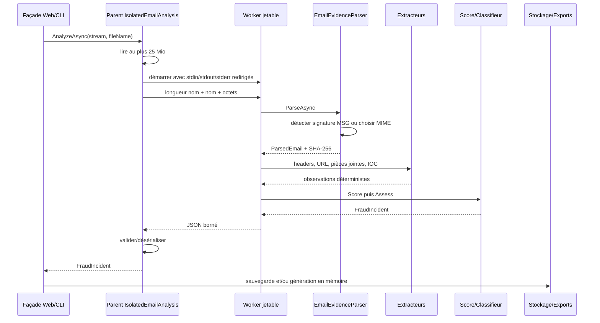
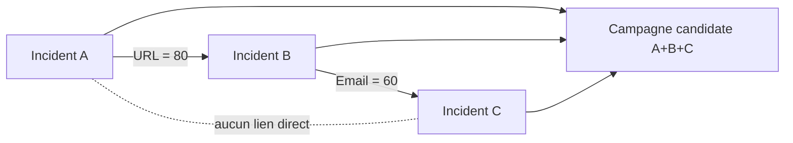

# 03 — Moteur d'analyse

## 1. Contrat d'entrée et de sortie

L'interface principale est :

```csharp
Task<FraudIncident> AnalyzeAsync(
    Stream emlStream,
    string? sourceFileName = null,
    CancellationToken cancellationToken = default);
```

Le nom historique `emlStream` n'exclut pas MSG : `EmailEvidenceParser` sélectionne le parseur d'après la signature binaire du contenu, pas d'après l'extension.

Le pipeline est intégralement local. Il ne visite aucune URL, ne fait pas de requête DNS, n'exécute pas de contenu et ne conserve pas les octets de la preuve ou des pièces jointes dans le `FraudIncident`.

## 2. Séquence complète



## 3. Bornes de sécurité

| Ressource | Limite |
|---|---:|
| fichier source | 25 Mio (`25 * 1024 * 1024`) |
| profondeur MIME | 32 |
| profondeur de groupes d'adresses | 16 |
| nombre d'en-têtes | 1 000 |
| caractères cumulés des en-têtes | 1 000 000 |
| caractères de chaque corps texte/HTML | 10 000 000 |
| nombre de pièces jointes | 100 |
| taille décodée par pièce jointe | 20 Mio |
| taille décodée cumulée des pièces jointes | 25 Mio |
| durée du worker | 30 s |
| mémoire du worker Windows | 256 Mio engagés par processus et par job |
| nombre de processus dans le Job Object | 1 |
| nom de fichier dans le protocole | 4 Kio UTF-8 |
| sortie JSON du worker | 16 Mio |
| erreur standard du worker | 64 Kio |
| profondeur de désérialisation IPC | 64 |

Les limites sont contrôlées à plusieurs étages : façade, buffer initial, parseur pendant le décodage, validation après parsing et protocole IPC.

## 4. Sélection et parsing du format

### 4.1 Détection

La signature Compound File Binary suivante sélectionne MSG :

```text
D0 CF 11 E0 A1 B1 1A E1
```

Tout autre contenu est tenté comme EML/MIME. Une erreur de parsing, hors annulation/quota/mémoire, devient `InvalidDataException` avec un message générique.

### 4.2 EML

`MimeKitEmailParser` :

- calcule le SHA-256 sur les octets originaux ;
- conserve les en-têtes dans leur ordre, doublons inclus ;
- extrait `TextBody` et `HtmlBody` ;
- décode les `MimePart` dans un `BoundedMemoryStream` ;
- sérialise une `MessagePart` attachée comme EML en mémoire ;
- applique `MaxMimeDepth` et `MaxAddressGroupDepth` à MimeKit.

### 4.3 MSG

`OutlookMsgEmailParser` :

- exige un objet dont le type commence par `Email` ;
- parse `TransportMessageHeaders` avec MimeKit ;
- complète `From`, `Subject` et `Message-ID` depuis les propriétés MSG lorsqu'ils manquent ;
- extrait pièces jointes binaires et messages MSG attachés ;
- refuse rendez-vous, contacts, tâches et autres objets Outlook.

### 4.4 Représentation intermédiaire

`ParsedEmail` contient : contenu brut Latin-1 réversible, SHA-256 source, en-têtes, corps texte/HTML et pièces jointes décodées. Cette structure ne quitte pas le worker et n'est pas persistée. Le snapshot final ne conserve donc ni corps du message ni contenu binaire.

## 5. Analyse des en-têtes

### 5.1 Identité déclarée

Le premier en-tête correspondant, sans distinction de casse, est trimé et copié. Aucune validation syntaxique ou comparaison entre `From`, `Reply-To` et `Return-Path` n'est effectuée.

### 5.2 Authentification

Seul le premier `Authentication-Results` est lu. Chaque mécanisme est extrait par recherche textuelle de :

```regex
(?:^|[;\s])mechanism\s*=\s*([A-Za-z0-9_-]+)
```

Les résultats sont mis en minuscules. Frelon **ne vérifie pas** SPF, DKIM ou DMARC ; il restitue ce que le message contient. Dans l'implémentation actuelle, `AuthenticationAssessment.IsSuspicious` n'est jamais positionné à `true` par `BasicEmailHeaderAnalyzer`.

### 5.3 Chaîne `Received`

Chaque en-tête `Received` produit une entrée numérotée dans l'ordre du parseur. Seuls `Position` et `RawValue` sont alimentés ; les champs structurés `From`, `By`, `With`, `IpAddress` et `Timestamp` restent `null`.

## 6. Extraction des URL

L'extracteur recherche dans le corps texte puis HTML :

```regex
https?://[^\s<>"']+
```

Il retire la ponctuation finale `. , ; : ) ] } " '` et déduplique sans tenir compte de la casse.

### 6.1 Règles de suspicion

| Règle | Condition |
|---|---|
| hôte IP littérale | `Uri.Host` est une IPv4/IPv6 valide |
| identité embarquée | `Uri.UserInfo` n'est pas vide, par ex. `https://trusted@host/` |
| chemin sensible sans TLS | schéma HTTP et segment sensible |
| domaine internationalisé sensible | label `xn--` et chemin sensible |

Marqueurs de chemin sensible : `login`, `signin`, `sign-in`, `account`, `verify`, `verification`, `password`, `credential`, `security`. Le chemin est découpé sur `/`, `.`, `_` et `-` après rapprochement de `sign-in` vers `signin`.

Exemples :

```text
http://192.0.2.10/login       -> IP littérale + chemin sensible sans TLS
https://bank.test@evil.test/  -> identité embarquée
https://xn--exmple-cua.test/account -> domaine internationalisé + chemin sensible
https://example.test/news     -> aucune règle locale déclenchée
```

### 6.2 Production d'IOC URL

Pour chaque URL, l'extracteur produit :

- un IOC `Url` de confiance `0.5` ;
- un IOC `IpAddress` si l'hôte est une IP, sinon `Domain`, de confiance `0.5`.

La source vaut `email-url`. La déduplication se fait sur `(type, valeur)` ; seul le domaine est explicitement abaissé en minuscules pour la clé.

## 7. Analyse des pièces jointes

Chaque pièce jointe est hashée en SHA-256. Le nom manquant devient `unnamed-attachment`.

### 7.1 Extensions exécutables ou scripts

```text
.exe .dll .scr .com .bat .cmd .ps1 .js .jse
.vbs .vbe .wsf .wsh .hta .msi .lnk .jar
```

### 7.2 Formats à contenu actif

```text
.html .htm .svg .docm .xlsm .pptm
```

### 7.3 Double extension trompeuse

Une raison supplémentaire est ajoutée lorsque l'extension finale est exécutable et que l'extension précédente ressemble à un document ou une image :

```text
facture.pdf.exe -> exécutable + double extension trompeuse
photo.jpg.js    -> script + double extension trompeuse
```

Les extensions leurres reconnues couvrent PDF, Office, images usuelles et texte.

### 7.4 Types MIME exécutables

```text
application/x-msdownload
application/x-msdos-program
application/x-executable
application/vnd.microsoft.portable-executable
```

Le type MIME est déclaratif : la règle ne réalise pas de détection par signature du contenu.

### 7.5 Production d'IOC hash

Chaque SHA-256 valide devient un IOC `Hash`, source `email-attachment`, confiance `1.0`, dédupliqué par valeur. Tous les hashes de pièces jointes sont produits, même si aucune règle de suspicion n'est déclenchée.

## 8. Score de risque

Le score est une somme bornée à 100.

| Signal | Poids | Multiplicité |
|---|---:|---|
| SPF vaut exactement `fail` après trim/casse | 15 | une fois |
| DKIM vaut `fail` | 15 | une fois |
| DMARC vaut `fail` | 30 | une fois |
| au moins une URL suspecte | 20 | une fois, quel que soit le nombre |
| au moins une pièce jointe suspecte | 30 | une fois, quel que soit le nombre |

Niveaux :

| Intervalle | Niveau |
|---:|---|
| `0` | `Unknown` |
| `]0, 25[` | `Low` |
| `[25, 50[` | `Medium` |
| `[50, 75[` | `High` |
| `[75, 100]` | `Critical` |

Exemple de calcul :

```text
SPF fail (15) + DMARC fail (30) + URL suspecte (20) = 65 / High
```

Un résultat `softfail`, `neutral`, `none` ou absent ne contribue pas au score.

## 9. Piste de classification automatique

Les règles sont évaluées dans cet ordre ; la première correspondance gagne.

| Priorité | Condition | Suggestion | Confiance |
|---:|---|---|---|
| 1 | pièce jointe suspecte **et** URL suspecte | `Suspicious` | `Medium` |
| 2 | pièce jointe suspecte | `Malware` | `Medium` |
| 3 | URL suspecte et au moins un échec d'authentification | `Phishing` | `Medium` |
| 4 | URL suspecte | `Suspicious` | `Low` |
| 5 | au moins deux échecs d'authentification | `Suspicious` | `Low` |
| 6 | `Authentication.IsSuspicious` | `Suspicious` | `Low` |
| 7 | sinon | `Unknown` | `None` |

La sortie contient toutes les raisons prévues par la branche choisie. Le classifieur n'attribue jamais les catégories `Spam`, `Scam`, `BrandImpersonation` ou `CredentialTheft`.

## 10. Corrélation de campagnes

### 10.1 Entrées éligibles

Seuls les IOC dont la confiance est finie et comprise entre `0.5` et `1.0` participent. `Unknown` et `FileName` ne possèdent aucun poids.

### 10.2 Normalisation et poids

| Type | Normalisation | Poids |
|---|---|---:|
| `Hash` | hexadécimal minuscule, longueur 32/40/64/96/128 | 100 |
| `Url` | HTTP(S) absolu, hôte IDN minuscule, port par défaut retiré | 80 |
| `IpAddress` | parsing puis forme canonique .NET | 70 |
| `Email` | local-part conservée, domaine IDN minuscule | 60 |
| `Domain` | point final retiré, IDN ASCII minuscule, DNS valide | 40 |

Les IOC identiques sont dédupliqués à l'intérieur d'un incident avant comparaison.

### 10.3 Qualification d'un lien

Pour chaque paire d'incidents :

1. si les preuves sources possèdent le même SHA-256 valide, la paire est ignorée ; cela évite de confondre un réimport du même message avec une campagne ;
2. les IOC normalisés communs sont listés ;
3. leurs poids sont additionnés ;
4. le lien est conservé si le total est au moins `60`.

Conséquences :

- un hash, une URL, une IP ou une adresse email suffit seul ;
- un domaine seul (`40`) ne suffit pas ;
- deux domaines distincts communs (`80`) suffisent ;
- le score n'est pas plafonné et n'est pas une probabilité.

### 10.4 Construction des campagnes

Les liens qualifiés sont réunis en composantes connexes par union-find. Un incident A lié à B et B lié à C produit une même campagne, même si A et C ne partagent aucun IOC qualifié directement.



La recherche Web charge au plus 100 incidents récents par défaut, 500 au maximum. Elle réalise actuellement une requête de détail par résumé après la requête de liste, soit un schéma de lecture de type `1 + N`.

## 11. Extension du moteur

Les ports permettent d'ajouter une règle sans modifier l'orchestrateur. Exemple conceptuel d'extracteur local :

```csharp
public sealed class CustomUrlExtractor : IEmailUrlExtractor
{
    public IReadOnlyList<UrlIndicator> ExtractUrls(ParsedEmail email)
    {
        ArgumentNullException.ThrowIfNull(email);
        // Toute extraction doit rester locale, bornée et sans ouvrir les URL.
        return [];
    }
}
```

Pour devenir le comportement de référence, l'implémentation doit ensuite être injectée dans `EmailIncidentAnalyzerFactory.CreateDefault()` et testée avec des entrées hostiles et des quotas explicites.

## 12. Références de code

- [`EmailAnalysisLimits.cs`](../../src/Frelon.Mail/EmailAnalysisLimits.cs)
- [`EmailEvidenceParser.cs`](../../src/Frelon.Mail/EmailEvidenceParser.cs)
- [`BasicEmailIncidentAnalyzer.cs`](../../src/Frelon.Mail/BasicEmailIncidentAnalyzer.cs)
- [`BasicEmailUrlExtractor.cs`](../../src/Frelon.Mail/BasicEmailUrlExtractor.cs)
- [`BasicEmailAttachmentAnalyzer.cs`](../../src/Frelon.Mail/BasicEmailAttachmentAnalyzer.cs)
- [`BasicIncidentRiskScorer.cs`](../../src/Frelon.Core/BasicIncidentRiskScorer.cs)
- [`CautiousIncidentClassifier.cs`](../../src/Frelon.Core/CautiousIncidentClassifier.cs)
- [`BasicIncidentCorrelator.cs`](../../src/Frelon.Core/BasicIncidentCorrelator.cs)

