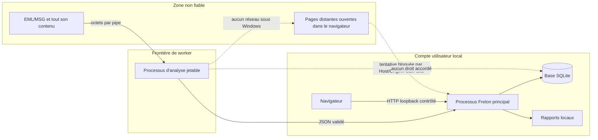

# 05 — Sécurité et exploitation

## 1. Modèle de confiance



Actifs principaux : poste et compte utilisateur, preuve et métadonnées, base et décisions humaines, rapports, exécutable, chaîne de publication.

Hypothèses :

- le fichier de message est entièrement hostile ;
- le navigateur local n'est pas intrinsèquement fiable car il affiche aussi des sites distants ;
- un autre processus du même compte n'est pas une source de confiance ;
- sous les systèmes non Windows, le worker est une frontière de panne/temps mais conserve les droits du parent.

## 2. Défense du processus d'analyse

### 2.1 Contrôles communs à toutes les plateformes

- worker distinct pour chaque analyse ;
- stdin/stdout/stderr anonymes et redirigés ;
- aucun octet hostile dans la ligne de commande ;
- corps, nom et réponses bornés ;
- délai global de 30 secondes ;
- arrêt forcé de l'arbre de processus sur annulation, délai ou erreur ;
- sérialisation JSON stricte avec enums textuels et profondeur 64 ;
- le parent vérifie au minimum l'identifiant et les objets obligatoires après désérialisation ;
- erreurs du worker transformées en catégories génériques, sans fuite de stack trace.

Sur une plateforme non Windows, `AnalysisWorkerProcess.StartPortable` démarre un processus standard avec les canaux redirigés. Aucune sandbox OS additionnelle n'est appliquée.

### 2.2 Renforcement Windows

Le démarrage Windows suit une logique d'échec fermé :

1. création d'un profil AppContainer éphémère nommé `Moralement.NET.Frelon.Worker.<identifiant>` ;
2. attribution temporaire de lecture/exécution au seul dossier contenant le code du worker ;
3. création d'un Job Object ;
4. création suspendue du processus avec liste explicite des handles hérités ;
5. jeton restreint : privilèges désactivés au maximum, mode LUA, intégrité basse ;
6. activation de l'AppContainer sans aucune capability ;
7. affectation et vérification du Job Object ;
8. vérification du jeton, de l'intégrité, de l'AppContainer et des capabilities ;
9. reprise du thread seulement après succès des vérifications ;
10. retrait de l'ACL temporaire et suppression du profil au nettoyage.

Limites du Job Object :

- un seul processus actif ;
- 256 Mio de mémoire par processus ;
- 256 Mio pour le job ;
- `KILL_ON_JOB_CLOSE`.

Le worker reçoit la preuve uniquement par pipe. Aucun accès à son chemin d'origine, à `incidents.db` ou aux rapports n'est nécessaire ni accordé par Frelon.

### 2.3 Comportement d'échec

Si Windows ne peut pas créer ou vérifier une restriction, le worker n'est pas relancé avec les droits ordinaires. L'analyse échoue. Cela protège le poste au prix d'une indisponibilité sur une configuration Windows incompatible.

## 3. Défense du serveur local

### 3.1 Écoute

Kestrel utilise `ListenLocalhost(port)`. Le port choisi doit être disponible exclusivement sur IPv4 loopback et, si supporté, IPv6 loopback. Aucune adresse LAN n'est configurée.

### 3.2 Validation de chaque requête

Avant les fichiers statiques et les endpoints, le middleware exige :

| Élément | Condition |
|---|---|
| adresse distante | `IPAddress.IsLoopback` |
| `Host` | `localhost`, IPv4 loopback ou IPv6 loopback **et** port attendu explicite |
| `Origin` | absent, ou exactement une origine HTTP loopback sur le port attendu |
| `Sec-Fetch-Site` | absent, `same-origin` ou `none` |

Le contrôle protège notamment contre le DNS rebinding et les appels initiés par une page distante vers `localhost`.

L'absence d'`Origin` et de `Sec-Fetch-Site` est acceptée pour préserver les clients non-navigateurs locaux. Il n'y a donc pas d'authentification forte d'un processus local ; un logiciel exécuté sous le même compte peut appeler l'API s'il construit les bons en-têtes. C'est cohérent avec le hors-périmètre déclaré pour un poste déjà compromis.

### 3.3 En-têtes de réponse

Chaque réponse reçoit :

```text
Cache-Control: no-store
Cross-Origin-Opener-Policy: same-origin
Cross-Origin-Resource-Policy: same-origin
Permissions-Policy: camera=(), geolocation=(), microphone=(), payment=(), usb=()
Referrer-Policy: no-referrer
X-Content-Type-Options: nosniff
X-Frame-Options: DENY
```

Politique CSP :

```text
default-src 'self'; base-uri 'none'; connect-src 'self';
font-src 'self'; form-action 'self'; frame-ancestors 'none';
img-src 'self' data:; manifest-src 'none'; object-src 'none';
script-src 'self'; style-src 'self'; worker-src 'none'
```

Il n'existe aucun script inline dans le contrat nécessaire : `script-src 'self'` reste compatible avec `app.js` servi localement.

### 3.4 Arrêt de l'application

L'arrêt est la seule commande de cycle de vie protégée par un jeton supplémentaire : 256 bits aléatoires, communiqué par l'API de session et comparé en temps constant. Ce jeton ne protège pas les autres mutations (analyse et revues), qui reposent sur la politique same-origin/loopback.

## 4. Sécurité des données et des exports

- Les octets de la source ne sont pas stockés par l'application Web ; seul le nom et le SHA-256 sont persistés.
- Le corps des messages et le contenu des pièces jointes disparaissent à la fin du worker.
- L'historique et les décisions résident en clair dans SQLite sous le profil utilisateur.
- Aucun chiffrement au repos applicatif, ACL durcie explicite ou gestion de clé n'est implémenté.
- Les exports complets peuvent contenir des données personnelles issues des en-têtes et IOC ; ils doivent être traités comme sensibles.
- Le CSV neutralise les cellules commençant, après espaces, par `=`, `+`, `-` ou `@` en préfixant une apostrophe.
- L'export IOC partageable applique une minimisation plus stricte, décrite dans [06 — Rapports et exports](06-reports-and-exports.md).

## 5. Configuration

### 5.1 Paramètres Web

| Clé | Défaut | Effet |
|---|---|---|
| `Frelon:Port` | `5127` | port préféré ; un port dynamique est choisi s'il est occupé |
| `Frelon:DataDirectory` | `%LOCALAPPDATA%/Frelon` sous Windows | base et fichiers de coordination |
| `Frelon:OpenBrowser` | `true` dans le paquet Windows, `false` en développement | ouverture automatique du navigateur |

Les clés sont lues via la configuration ASP.NET Core. Exemple par variables d'environnement PowerShell :

```powershell
$env:Frelon__Port = '6200'
$env:Frelon__DataDirectory = 'D:\FrelonData'
$env:Frelon__OpenBrowser = 'false'
dotnet run --project src/Frelon.Web
```

Exemple en arguments de configuration :

```powershell
dotnet run --project src/Frelon.Web -- --Frelon:Port 6200 --Frelon:OpenBrowser false
```

### 5.2 Contenu du dossier de données

```text
Frelon/
├── incidents.db     # snapshots et décisions
├── .frelon.lock     # verrou exclusif de l'instance active
└── .frelon-url      # URL de l'instance active
```

`.frelon.lock` et `.frelon-url` sont supprimés au mieux lors d'un arrêt normal. Un fichier résiduel n'empêche pas le redémarrage si aucun processus ne conserve le verrou.

### 5.3 Sauvegarde et restauration

Procédure prudente déduite du mode de stockage :

1. arrêter Frelon proprement ;
2. copier `incidents.db` vers un emplacement protégé ;
3. conserver les permissions et la confidentialité de la copie ;
4. pour restaurer, arrêter Frelon puis remplacer la base dans le dossier explicitement configuré.

Le dépôt ne fournit pas encore de commande de backup, de vérification d'intégrité, de rétention ou de migration. Toute restauration doit donc être validée sur une copie.

## 6. Journalisation et erreurs

Le Web efface les fournisseurs par défaut et active :

- console ;
- sortie Debug.

Aucun journal applicatif persistant ou structuré n'est configuré. Les erreurs HTTP exposées sont volontairement génériques :

- `400` pour requête ASP.NET invalide, `InvalidDataException`, quota ou timeout d'analyse ;
- `500` pour le reste ;
- titre générique, sans message d'exception interne.

La CLI adopte la même philosophie et retourne des messages stables mais peu détaillés. Le diagnostic approfondi dépend donc de la console/debug et des tests reproductibles.

## 7. Build et distribution

### 7.1 Baseline

- SDK déclaré : `.NET 10.0.301`, roll-forward vers le dernier feature band, préversions autorisées ;
- builds déterministes ;
- nullable et implicit usings activés dans chaque projet ;
- runtime de publication : `win-x64`.

### 7.2 Publication Windows

Le profil `win-x64.pubxml` produit :

- application autonome (`SelfContained=true`) ;
- fichier principal unique et natifs auto-extraits ;
- compression activée ;
- trimming désactivé ;
- symboles et debug désactivés ;
- `WinExe` ;
- constante `FRELON_PACKAGED_APP`, donc ouverture navigateur par défaut.

Commande :

```powershell
dotnet restore src/Frelon.Web/Frelon.Web.csproj -r win-x64 --locked-mode
dotnet publish src/Frelon.Web/Frelon.Web.csproj -c Release --no-restore `
  -p:PublishProfile=win-x64 -o artifacts/Frelon-win-x64
```

Le publish empaquette la licence MPL-2.0, le guide, les notices tierces du projet et celles du runtime .NET. Les symboles sont retirés pour le paquet final.

### 7.3 CI et release

Le pipeline principal sous Ubuntu restaure en mode verrouillé, compile en Release et exécute tous les tests. Le pipeline Windows :

- vérifie l'isolation Windows ;
- publie l'application autonome ;
- exécute un smoke test sur l'échantillon ;
- crée un ZIP versionné et son fichier SHA-256 ;
- valide les actifs ;
- pour un tag `v*` appartenant à `master`, crée ou met à jour une GitHub Release en brouillon.

Les actions GitHub sont épinglées sur des SHA de commit et les permissions sont limitées par job.

## 8. Procédure d'exploitation locale

### Démarrage développement

```powershell
dotnet run --project src/Frelon.Web
```

### Vérification santé minimale

```powershell
Invoke-RestMethod http://localhost:5127/api/application/info
```

Ce test doit être exécuté avec un `Host` correspondant exactement au port actif. Si le port 5127 est pris, l'URL réelle est affichée dans la console et enregistrée dans `.frelon-url`.

### Arrêt

Utiliser le bouton **Quitter Frelon**, `Ctrl+C` dans la console, ou fermer le processus. Fermer seulement l'onglet ne stoppe pas le serveur.

## 9. Registre des risques techniques

| Risque/limite | État | Impact |
|---|---|---|
| exécutable non signé | documenté | SmartScreen et absence de preuve éditeur |
| données SQLite en clair | confirmé | exposition si le profil utilisateur est compromis |
| worker non sandboxé hors Windows | confirmé | isolation limitée au processus/temps |
| absence de réputation/enrichissement | choix de conception | faux négatifs possibles |
| `Authentication-Results` seulement déclaratif | confirmé | en-tête falsifiable, pas de validation cryptographique |
| corps et pièces jointes non persistés | confirmé | confidentialité améliorée, mais investigation ultérieure limitée sans source originale |
| pas de migration SQLite | confirmé | future évolution de schéma à concevoir |
| pas d'authentification d'utilisateur local | confirmé | tout processus local capable de satisfaire la politique HTTP peut appeler l'API |
| pas de suppression/rétention | confirmé | croissance de la base et obligations de conservation à gérer manuellement |
| sauvegarde/reprise non automatisée | confirmé | risque opérationnel en cas de corruption/perte |

## 10. Références de code

- [`AnalysisWorkerProcess.cs`](../../src/Frelon.Mail/AnalysisWorkerProcess.cs)
- [`WindowsAppContainerProfile.cs`](../../src/Frelon.Mail/WindowsAppContainerProfile.cs)
- [`LocalHttpSecurityPolicy.cs`](../../src/Frelon.Web/LocalHttpSecurityPolicy.cs)
- [`LocalApplicationInstance.cs`](../../src/Frelon.Web/LocalApplicationInstance.cs)
- [`win-x64.pubxml`](../../src/Frelon.Web/Properties/PublishProfiles/win-x64.pubxml)
- [modèle de menace existant](../security-threat-model.md)

