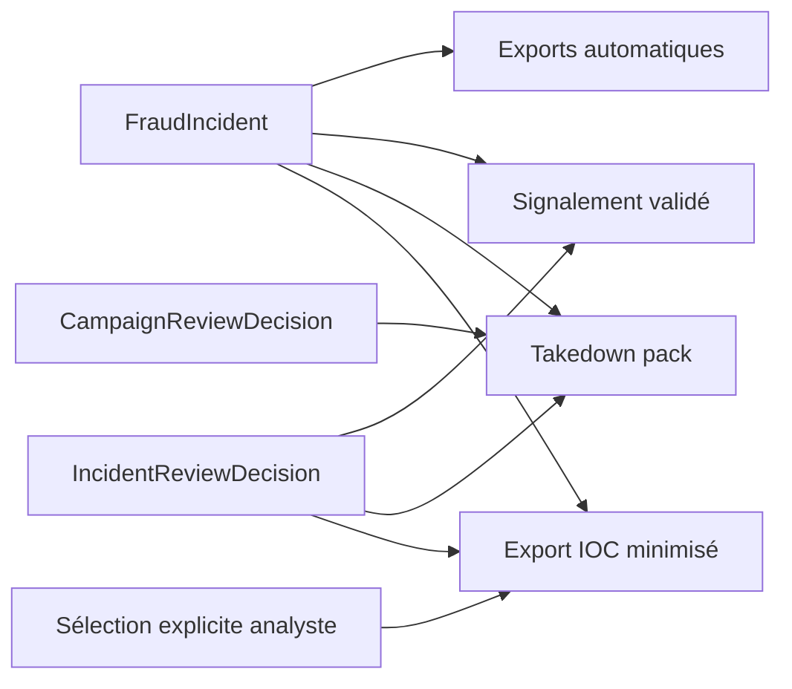
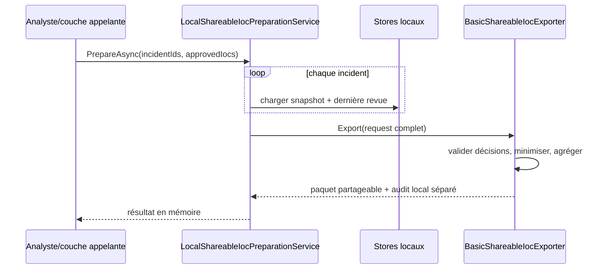

# 06 — Rapports et exports

## 1. Principe général

Les générateurs de `Frelon.Reports` et `Frelon.Exporters` sont sans accès réseau et retournent des chaînes ou des octets en mémoire. L'écriture sur disque appartient à la CLI ; le téléchargement appartient au Web. Les cas d'usage de `Frelon.Application` chargent les sources locales mais n'écrivent et n'envoient rien.



## 2. Exports d'incident standards

| Fichier | Producteur | Contenu |
|---|---|---|
| `incident.json` | `SystemTextJsonIncidentJsonWriter` | snapshot `FraudIncident` complet, enums numériques |
| `report.md` | `BasicIncidentMarkdownReportWriter` | restitution humaine automatique détaillée |
| `iocs.json` | `SystemTextJsonIocsJsonWriter` | identifiant, date de génération, IOC, enums textuels |
| `iocs.csv` | `BasicIocCsvExporter` | IOC tabulaires, culture invariante, protection tableur |
| `review.json` | `IncidentExportService` | dernière décision humaine |
| `signalement.md` | `BasicValidatedIncidentMarkdownReportWriter` | rapport autorisé par fraude confirmée |

Les fichiers texte téléchargés par le Web sont UTF-8 sans BOM. Le bundle ZIP contient les quatre exports automatiques, puis `review.json` et éventuellement `signalement.md` si une revue existe.

### 2.1 `incident.json`

Ce document est le format le plus complet : preuve, identité, authentification, chaîne Received, URL, pièces jointes, IOC, classification, piste, score et actions. Il est indenté en camelCase.

Attention contractuelle : faute de `JsonStringEnumConverter` dans ce writer, les enums sont sérialisés par leur valeur numérique. Ce choix est couvert par les tests actuels et diffère de l'API et de `iocs.json`.

### 2.2 `report.md`

Sections : résumé, piste automatique, explication du score, preuve, identité déclarée, authentification, chaîne Received, URL, pièces jointes, IOC et actions recommandées.

Le document annonce qu'il s'agit d'une analyse automatique sans validation humaine. Les valeurs issues du message sont interpolées directement dans ce rapport de base. Elles doivent être considérées comme du Markdown non fiable lors de l'ouverture dans un moteur riche ; contrairement au rapport validé, ce writer ne possède pas de fonction générale de neutralisation Markdown.

### 2.3 `iocs.json`

```json
{
  "incidentId": "8c904d68-8a9a-4fb3-b799-3018c930829c",
  "generatedAt": "2026-07-31T12:15:00+00:00",
  "iocs": [
    {
      "type": "Domain",
      "value": "example.test",
      "confidence": 0.5,
      "source": "email-url",
      "firstSeen": "2026-07-31T12:00:00+00:00"
    }
  ]
}
```

`generatedAt` est recalculé à chaque production ; deux exports du même incident peuvent donc différer sans que le snapshot ait changé.

### 2.4 `iocs.csv`

```csv
type,value,confidence,source,firstSeen
Domain,example.test,0.5,email-url,2026-07-31T12:00:00.0000000+00:00
```

Les séparateurs sont des virgules et les fins de ligne CRLF. Les nombres et dates utilisent la culture invariante. Les guillemets sont doublés. Une valeur pouvant être interprétée comme formule reçoit une apostrophe initiale.

## 3. Décision et signalement validé

`review.json` est uniquement disponible lorsqu'au moins une revue existe. Il expose la dernière décision, pas tout l'historique.

`signalement.md` est produit si et seulement si :

```text
Verdict == ConfirmedFraud
AND Classification != null
AND Classification NOT IN (Unknown, Suspicious)
```

Le writer vérifie aussi que l'identifiant d'incident de la décision correspond à l'incident exporté.

Le signalement contient :

- la validation humaine, son identifiant, sa date et ses notes ;
- la traçabilité de la preuve ;
- l'identité déclarée ;
- les observations automatiques explicitement subordonnées à la décision ;
- les IOC et pièces jointes ;
- un rappel que le destinataire et le canal restent à vérifier.

Les caractères Markdown de contrôle, balises HTML et contrôles issus des champs sont neutralisés par `Escape`, ce qui rend ce document plus adapté à une transmission manuelle que `report.md`.

## 4. Export IOC à partage contrôlé

### 4.1 Cas d'usage

`LocalShareableIocPreparationService` reçoit :

- un identifiant d'export nouveau ;
- une date de préparation ;
- une liste d'incidents locaux distincts ;
- une liste d'IOC explicitement approuvés (`Domain` ou `Hash`).

Il recharge chaque incident et sa dernière revue, puis délègue à `BasicShareableIocExporter`.



### 4.2 Préconditions

- chaque incident possède exactement une décision fournie ;
- la dernière décision est `ConfirmedFraud` avec catégorie précise ;
- la préparation ne précède aucune décision utilisée ;
- chaque preuve possède un SHA-256 valide ;
- chaque IOC approuvé est observé dans les incidents validés ;
- confiance de l'observation entre `0.5` et `1.0` ;
- le hash d'une preuve source ne peut jamais être partagé comme IOC ;
- après normalisation, les sélections restent distinctes.

### 4.3 Profil `StrictMinimization`

Seuls sont éligibles :

- domaines DNS valides contenant au moins un point, normalisés en IDN ASCII minuscule ;
- SHA-256 hexadécimaux minuscules de 64 caractères.

Sont volontairement absents : identifiants d'incident/revue, noms et hashes des preuves, identités email, emails, IP, noms de fichier, URL complètes, sources internes, notes et horodatages précis.

Le paquet ne conserve que le jour UTC, pas l'heure. Chaque IOC expose le nombre d'incidents où il apparaît et un libellé de confiance : `High` si la confiance minimale agrégée est au moins `0.8`, sinon `Medium`.

### 4.4 Artefacts

```text
frelon-iocs-partage-{exportIdN}.zip   # nom suggéré, archive non créée ici
├── LISEZ-MOI.md
├── iocs-partage.json
└── iocs-partage.csv
```

Le résultat contient deux zones explicitement séparées :

| Zone | Peut quitter Frelon ? | Contenu |
|---|---|---|
| `ShareablePackage` | après revue humaine/juridique | trois documents minimisés |
| `LocalAudit` | non | sources, IDs, hashes de preuve, décisions, digests des artefacts et compteurs |

Le SHA-256 de chaque contenu UTF-8 est calculé et conservé dans l'audit local.

### 4.5 Exemple d'appel

```csharp
var service = new LocalShareableIocPreparationService(
    incidentStore,
    reviewStore,
    new BasicShareableIocExporter());

var result = await service.PrepareAsync(
    new ShareableIocPreparationRequest(
        Guid.NewGuid(),
        DateTimeOffset.UtcNow,
        [incidentId],
        [new ShareableIocSelection(IocType.Domain, "example.test")]));

// Examiner result.ShareablePackage avant toute écriture ou transmission.
// Conserver result.LocalAudit exclusivement dans la zone locale de confiance.
```

## 5. Takedown pack multi-destinataires

### 5.1 Cas d'usage

`LocalTakedownPackPreparationService` part d'une empreinte de campagne et de rôles de destinataires. Il recharge :

- la dernière revue de campagne ;
- tous les incidents du snapshot confirmé ;
- la dernière revue individuelle de chaque incident.

Le service transmet ensuite l'ensemble à `BasicTakedownPackWriter`.

### 5.2 Préconditions

- campagne `Confirmed` ;
- incidents fournis exactement égaux à la composition confirmée ;
- une revue individuelle par incident ;
- chaque incident `ConfirmedFraud` avec catégorie précise ;
- SHA-256 de preuve valide pour chaque incident ;
- date de préparation postérieure ou égale à toutes les décisions ;
- au moins un rôle de destinataire distinct ;
- chaque rôle possède au moins un élément technique applicable.

Le cas d'usage recharge les **dernières** revues au moment de la préparation. Il ne se contente pas de décisions fournies par le client.

### 5.3 Rôles et filtrage

| Rôle | IOC inclus | Condition d'applicabilité |
|---|---|---|
| `HostingProvider` | URL, domaine, IP | au moins un IOC pertinent |
| `DomainRegistrar` | domaine | au moins un domaine |
| `EmailProvider` | email | au moins une trace d'identité/authentification dans les incidents |
| `AntiPhishingService` | URL, domaine, IP, email, hash | au moins un IOC pertinent |

Les IOC de confiance inférieure à `0.5`, non finis, vides, `Unknown` ou `FileName` sont exclus. Ils sont dédupliqués avec des règles adaptées au type et ordonnés de façon stable.

### 5.4 Artefacts

Le pack contient toujours :

```text
LISEZ-MOI.md
manifest.json
```

Puis un document par rôle choisi :

```text
signalement-hebergeur.md
signalement-registrar.md
signalement-fournisseur-messagerie.md
signalement-anti-phishing.md
```

Nom d'archive suggéré : `frelon-takedown-{packIdN}.zip`. Comme pour l'export IOC, la bibliothèque ne crée pas l'archive et n'écrit aucun fichier.

Le manifeste trace pack, campagne, décision de campagne, incidents, SHA-256 de preuves, revues individuelles et noms des documents. Les documents restent des brouillons ; Frelon ne recherche pas les coordonnées réelles et ne choisit aucun destinataire.

### 5.5 Exemple d'appel

```csharp
var service = new LocalTakedownPackPreparationService(
    incidentStore,
    incidentReviewStore,
    campaignReviewStore,
    new BasicTakedownPackWriter());

var pack = await service.PrepareAsync(
    new TakedownPackPreparationRequest(
        Guid.NewGuid(),
        DateTimeOffset.UtcNow,
        campaignFingerprint,
        [TakedownRecipientType.DomainRegistrar],
        "Contexte interne à relire avant transmission."));
```

## 6. État d'exposition

| Capacité | Web | CLI | Bibliothèque |
|---|---:|---:|---:|
| exports d'incident standards | oui | oui | oui |
| décision JSON | oui | non | oui |
| signalement validé | oui | non | oui |
| bundle ZIP incident | oui | non | oui |
| export IOC minimisé | non | non | oui |
| takedown pack | non | non | oui |

L'intégration future des deux dernières capacités nécessitera une couche de présentation qui préserve la séparation entre documents partageables et audit local.

## 7. Références de code

- [`IncidentExportService.cs`](../../src/Frelon.Web/IncidentExportService.cs)
- [`BasicIncidentMarkdownReportWriter.cs`](../../src/Frelon.Reports/BasicIncidentMarkdownReportWriter.cs)
- [`BasicValidatedIncidentMarkdownReportWriter.cs`](../../src/Frelon.Reports/BasicValidatedIncidentMarkdownReportWriter.cs)
- [`BasicShareableIocExporter.cs`](../../src/Frelon.Exporters/BasicShareableIocExporter.cs)
- [`LocalShareableIocPreparationService.cs`](../../src/Frelon.Application/LocalShareableIocPreparationService.cs)
- [`BasicTakedownPackWriter.cs`](../../src/Frelon.Reports/BasicTakedownPackWriter.cs)
- [`LocalTakedownPackPreparationService.cs`](../../src/Frelon.Application/LocalTakedownPackPreparationService.cs)

