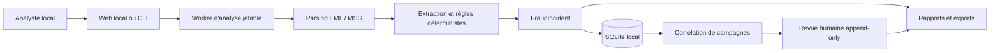

# Spécification technique reconstruite de Frelon

> Rétroconception du dépôt au commit `ae3cf15403818846a10b399a13bfd42e10bd1d29`, réalisée le 31 juillet 2026. Version applicative déclarée : `0.1.0-beta.1`.

## 1. Objet du document

Cette documentation décrit le système tel qu'il est effectivement implémenté. Elle part du code source, des tests, des fichiers de build et des documents d'exploitation ; elle ne remplace pas une spécification fonctionnelle validée par le propriétaire du produit.

Le périmètre est le dépôt **Frelon** : analyse locale de fichiers EML/MSG, modèle d'incident, stockage SQLite, corrélation, revue humaine, exports, CLI et application Web locale. Le dépôt voisin `FrelonMailWeb` n'est pas référencé par le code analysé et reste hors périmètre.

## 2. Résumé exécutif

Frelon est une application de cybersécurité défensive, locale et déterministe. Elle transforme un fichier de courrier électronique potentiellement hostile en un snapshot d'incident explicable, sans ouvrir de lien, exécuter de pièce jointe ni contacter de service distant.

Le système possède deux points d'entrée :

- une application Web ASP.NET Core servie exclusivement sur la boucle locale ;
- une CLI capable d'analyser, d'exporter et de consulter une base locale.

Les deux façades utilisent le même moteur d'analyse. Chaque analyse est déportée dans un processus jetable. Sous Windows, ce worker est placé dans un AppContainer sans capability réseau, avec jeton restreint, intégrité basse, Job Object limité à un processus et 256 Mio, puis arrêté au bout de 30 secondes au maximum.

Le résultat automatique ne constitue jamais un verdict. Les décisions humaines d'incident et de campagne sont enregistrées séparément, de manière append-only. Une campagne est recalculée à la demande à partir d'IOC exacts ; une revue de campagne conserve le snapshot précis que l'analyste a examiné.

## 3. Carte documentaire

| Document | Contenu |
|---|---|
| [01 — Architecture](01-architecture.md) | contexte, composants, dépendances, processus et points d'entrée |
| [02 — Domaine et stockage](02-domain-and-storage.md) | agrégats, invariants, schéma SQLite et cohérence |
| [03 — Moteur d'analyse](03-analysis-engine.md) | parsing, quotas, heuristiques, score, classification et corrélation |
| [04 — Interfaces](04-interfaces.md) | API HTTP, CLI, interface navigateur et exemples |
| [05 — Sécurité et exploitation](05-security-and-operations.md) | frontières de confiance, isolation, configuration, build et déploiement |
| [06 — Rapports et exports](06-reports-and-exports.md) | formats, signalement validé, export IOC minimisé et takedown pack |
| [07 — Tests et traçabilité](07-testing-and-traceability.md) | stratégie de test, CI, sources, certitudes et écarts |

## 4. Convention de certitude

Les conclusions utilisent trois niveaux :

- **Confirmé** : comportement directement présent dans le code ou verrouillé par un test.
- **Déduit** : conséquence technique forte du code, mais sans contrat ou test explicite.
- **À valider** : intention produit, choix opérationnel ou comportement externe qui ne peut pas être établi uniquement à partir du dépôt.

Sauf mention contraire, les règles, seuils, routes et formats de cette spécification sont confirmés par le code.

## 5. Principes structurants reconstruits

1. **Local-first** : aucune dépendance métier à un service distant et aucune résolution réseau lors de l'analyse.
2. **Entrée hostile** : le message, ses en-têtes, son HTML, ses noms de fichiers et ses pièces jointes sont non fiables.
3. **Déterminisme et explicabilité** : les scores sont des sommes de règles, pas des probabilités.
4. **Séparation calcul/décision** : l'automate propose ; l'humain conclut dans un journal séparé.
5. **Non-réécriture** : les incidents et décisions sont ajoutés ; le système ne fournit pas d'opération de modification ou suppression.
6. **Minimisation** : les exports partageables excluent par défaut les données qui ne sont pas strictement nécessaires.
7. **Échec fermé sous Windows** : si l'isolation forte du worker ne peut pas être appliquée et vérifiée, l'analyse est refusée.

## 6. Limites essentielles

Frelon n'est ni un antivirus, ni un sandbox dynamique, ni un moteur de réputation. Il ne suit pas les redirections, ne résout pas les domaines, ne valide pas cryptographiquement SPF/DKIM/DMARC, ne déchiffre pas les archives et ne détecte pas le contenu visuel tel qu'un QR code. L'absence de signal ne prouve donc jamais qu'un message est sûr.

## 7. Sources primaires

Les principaux points d'ancrage sont :

- [`Frelon.slnx`](../../Frelon.slnx) et les fichiers projet sous [`src/`](../../src/) ;
- [`Program.cs` Web](../../src/Frelon.Web/Program.cs) et [`Program.cs` CLI](../../src/Frelon.Cli/Program.cs) ;
- [`FraudIncident.cs`](../../src/Frelon.Core/Models/FraudIncident.cs) ;
- [`EmailIncidentAnalyzerFactory.cs`](../../src/Frelon.Mail/EmailIncidentAnalyzerFactory.cs) ;
- [`SqliteIncidentStore.cs`](../../src/Frelon.Storage/SqliteIncidentStore.cs) ;
- les huit projets sous [`tests/`](../../tests/) ;
- le [modèle de menace](../security-threat-model.md) et les workflows sous [`.github/workflows`](../../.github/workflows/).

